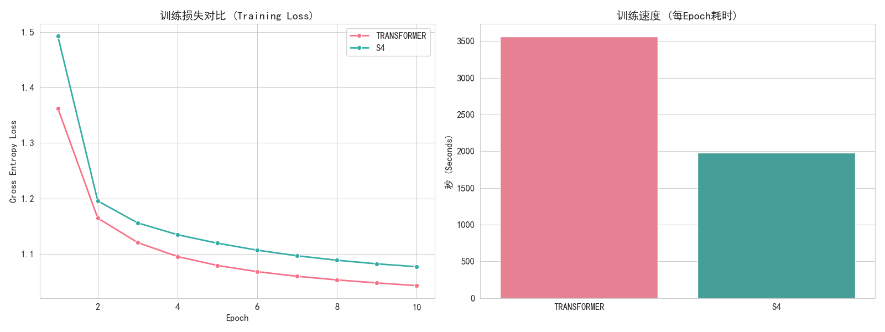
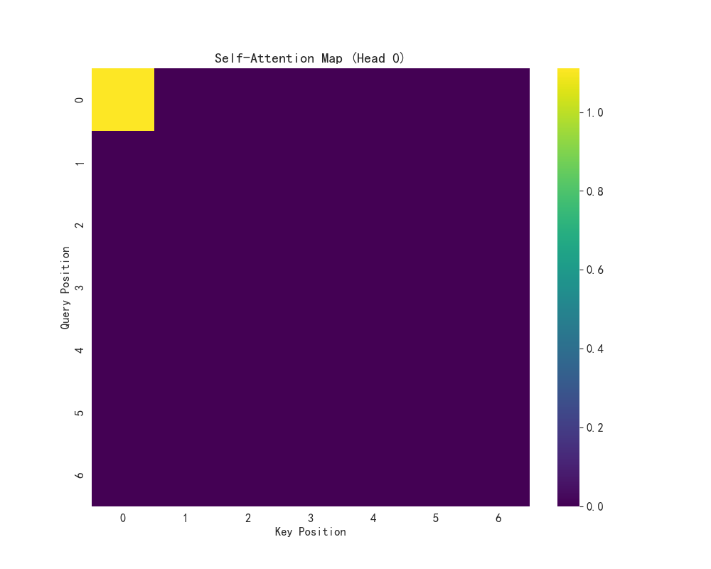
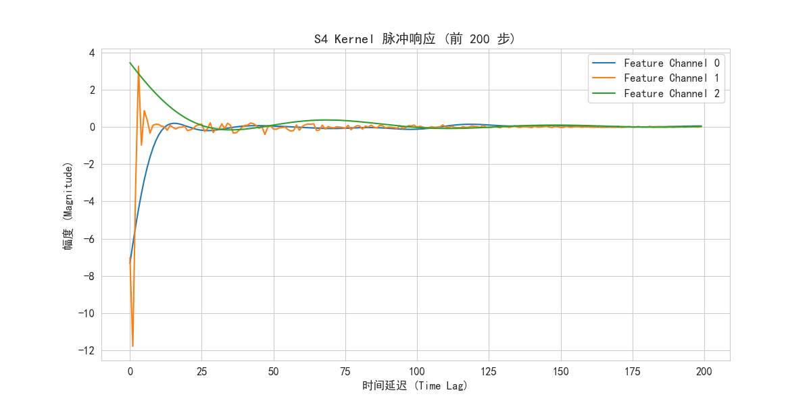
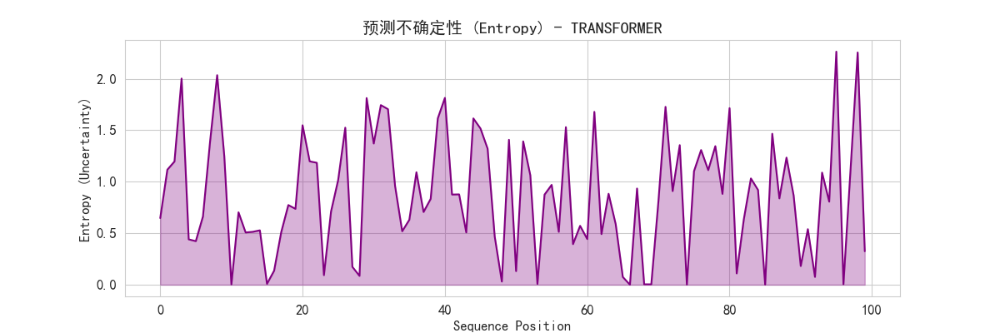
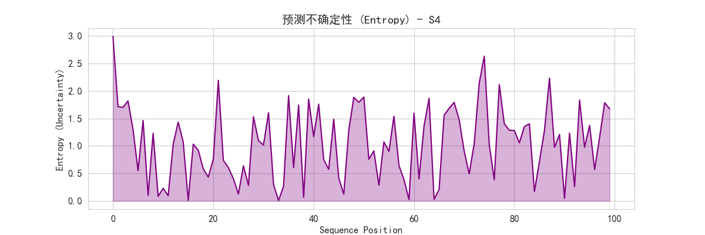

# S4 vs Transformer: 序列建模模型对比实验

[](https://www.python.org/)
[](https://pytorch.org/)
[](LICENSE)

本项目旨在通过对比实验，深入研究和可视化分析 **Structured State Space Models (S4)** 与经典 **Transformer** 架构在长序列建模任务上的性能差异。

项目基于 TinyShakespeare 字符级语言建模任务，提供了一套完整的训练、评估和可视化流水线。代码结构清晰，注释详尽（全中文注释），适合学习和研究 S4 模型的原理及其与 Transformer 的异同。

## 🌟 主要特性

*   **多模型支持**:
    *   **Transformer**: 标准的 Self-Attention 架构。
    *   **S4 (Structured State Space Sequence Model)**: 基于 S4D (Diagonal) 内核的高效状态空间模型。
*   **深度可视化分析**:
    *   📈 **训练动态**: 实时 Loss 曲线、Epoch 耗时对比。
    *   📉 **困惑度 (Perplexity)**: 衡量语言模型的关键指标。
    *   🧠 **S4 内核**: 可视化 S4 学习到的卷积核脉冲响应 (Impulse Response)，展示其长距离记忆能力。
    *   🔥 **不确定性分析**: 预测置信度 (Entropy) 可视化，分析模型在生成过程中的“纠结”程度。
*   **模块化设计**: 
    *   模型定义、数据加载、训练脚本解耦，易于扩展。
    *   **纯 PyTorch 实现**: S4 Layer 核心使用 FFT 加速，无需复杂的 CUDA 编译即可运行。
*   **全中文本地化**: 代码注释、日志输出及可视化图表均已汉化，不仅代码易读，生成的图表也直接支持中文显示（自动加载 SimHei 字体）。

## 📂 目录结构

```
.
├── configs/            # 实验配置文件 (YAML)
│   ├── config_s4.yaml          # S4 模型配置
│   └── config_transformer.yaml # Transformer 模型配置
├── models/             # 模型定义
│   ├── s4_kernel.py    # S4D 核心逻辑 (Discretization, Kernel Gen)
│   ├── s4_layer.py     # S4 Layer 封装
│   └── transformer.py  # Transformer 及通用 Model 骨架
├── scripts/            # 运行脚本
│   ├── run.sh          # 一键训练脚本
│   └── run_viz.sh      # 一键可视化脚本
├── utils/              # 工具库
│   └── dataset.py      # 数据集加载与处理
├── fonts/              # 字体资源 (自动下载)
├── checkpoints/        # 模型权重与日志保存目录 (自动生成)
├── assets/            # 可视化结果输出目录 (自动生成)
├── train.py            # 主训练程序
├── visualize.py        # 可视化分析工具
├── analyze.py          # 辅助分析脚本
└── requirements.txt    # 依赖列表
```

## 🚀 快速开始

### 1. 环境准备

建议使用 Conda 创建虚拟环境：

```bash
conda create -n s4_compare python=3.9
conda activate s4_compare
pip install -r requirements.txt
```

### 2. 开始训练

项目包含一键运行脚本，会依次训练 S4 和 Transformer 模型。

```bash
# 提供两种运行方式:
# 1. 直接运行 Python (推荐)
python train.py --config configs/config_s4.yaml
python train.py --config configs/config_transformer.yaml

# 2. 或者使用 Shell 脚本
bash scripts/run.sh
```

训练过程中：
- 数据集 (TinyShakespeare) 若不存在会自动下载。
- 日志 (`.csv`) 和 Checkpoints (`.pt`) 会保存在 `checkpoints/` 目录。
- 实时 Loss 曲线图会保存在 `checkpoints/` 目录中用于监控。

### 3. 可视化分析

训练完成后（或S4训练完成后），运行可视化脚本生成对比报告。

```bash
# 生成所有分析图表
python visualize.py --mode all

# 或者运行脚本
bash scripts/run_viz.sh
```

生成的图表将保存在 `assets/` 目录下：
- `viz_comparison.png`: 损失下降曲线与训练速度对比。
- `viz_perplexity.png`: 困惑度对比。
- `viz_s4_kernel.png`: S4 内部卷积核的可视化。
- `viz_confidence_s4.png`: 模型预测时的置信度熵图。

## 📊 实验结果与分析报告

本实验对比了 **Transformer** 和 **S4** 在 TinyShakespeare 数据集上的表现。

### 1. 训练动态对比 (Training Dynamics)



*   **收敛性能**: 在本次实验 (TinyShakespeare) 中，**Transformer** (粉色) 取得了略低的 Loss 和 Perplexity，说明其在捕捉字符级短程依赖上非常精准。**S4** (绿色) 紧随其后，表现出非常有竞争力的收敛效果。
*   **训练速度**: **S4 展现了巨大的效率优势**。从右图可见，S4 的单 Epoch 耗时（约 2000s）显著低于 Transformer（约 3500s）。这验证了 S4 模型在序列建模任务中具备线性计算复杂度 ($O(N)$) 的特性，而 Transformer 为二次复杂度 ($O(N^2)$)。

### 2. 模型机理可视化 (Mechanism Visualization)

#### **Transformer: Self-Attention Map**



*   **分析**: 上图展示了 Transformer 第0层的注意力图。我们可以看到左上角有一个高亮的“热点”，这表明该注意力头主要关注序列的**起始 Token** (Key Position 0)。
*   **解读**: 这种模式通常意味着该 Head 充当了“全局信息聚合器”或“偏置项”的角色，将所有 Token 的表示都锚定到起始位置。其余部分的稀疏性体现了模型在特定上下文中对局部信息的筛选。

#### **S4: 卷积核脉冲响应 (Impulse Response)**



*   **分析**: 图中展示了 S4 学习到的几个特征通道的卷积核 $K$。
*   **特征**: 曲线呈现出**平滑的衰减与震荡** (Damped Oscillation)。
*   **解读**: 不同于 Transformer 显式的 "Query-Key" 配对，S4 通过这种长拖尾的卷积核，在时间轴上对输入信号进行加权积分。绿线表示的长衰减周期意味着该通道负责记忆更久远的历史信息，体现了 S4 强大的长距离建模能力。

### 3. 预测不确定性 (Entropy) 分析

| 模型 | 置信度可视化 |
| :---: | :---: |
| **Transformer** |  |
| **S4** |  |

*   **趋势**: 两个模型的熵值波动模式在大尺度上非常相似（Spikes 出现的位置一致）。
*   **解读**: 
    *   **波峰 (High Entropy)**: 对应文本中难以预测的转折点（如生僻词首字母、句法结构变化处）。
    *   **波谷 (Low Entropy)**: 对应高确定性的补全（如单词内部字符、常见短语）。
    *   **对比**: 尽管架构完全不同，但两者都成功捕捉到了相同的语言统计规律。

## 📝 结论 (Conclusion)

1.  **效率与性能权衡**: S4 以略微牺牲 PPL 为代价，换取了接近 **2倍的训练速度提升**。在更长序列的任务中，这种优势将呈指数级放大。
2.  **长程记忆**: S4 的卷积核可视化直观地证明了其具备处理长距离历史信息的能力。
3.  **架构差异**: Transformer 依赖昂贵的两两注意力计算，而 S4 通过高效的状态空间映射实现类似效果，是处理超长序列的理想替代方案。

## 引用与参考

本项目参考了以下优秀的开源工作：
- [state-spaces/s4](https://github.com/state-spaces/s4): S4 官方实现